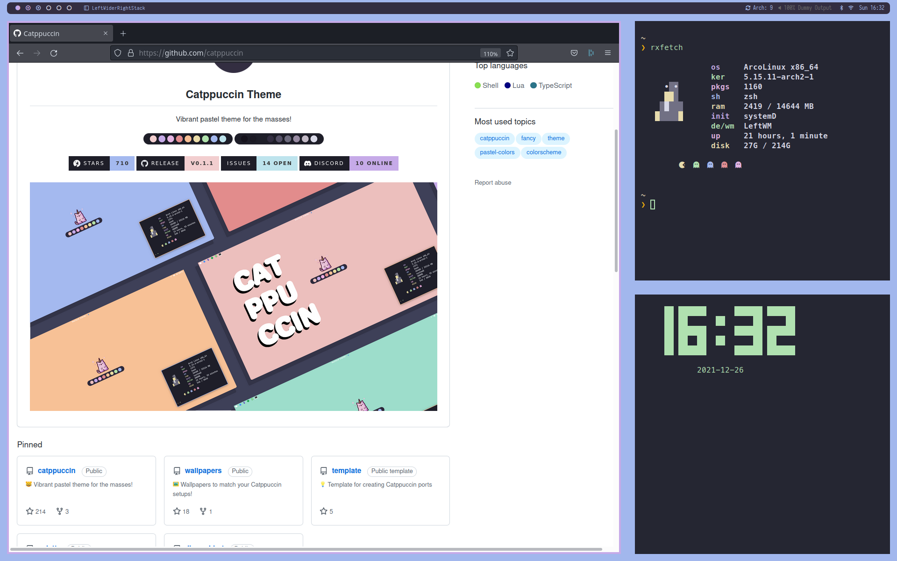
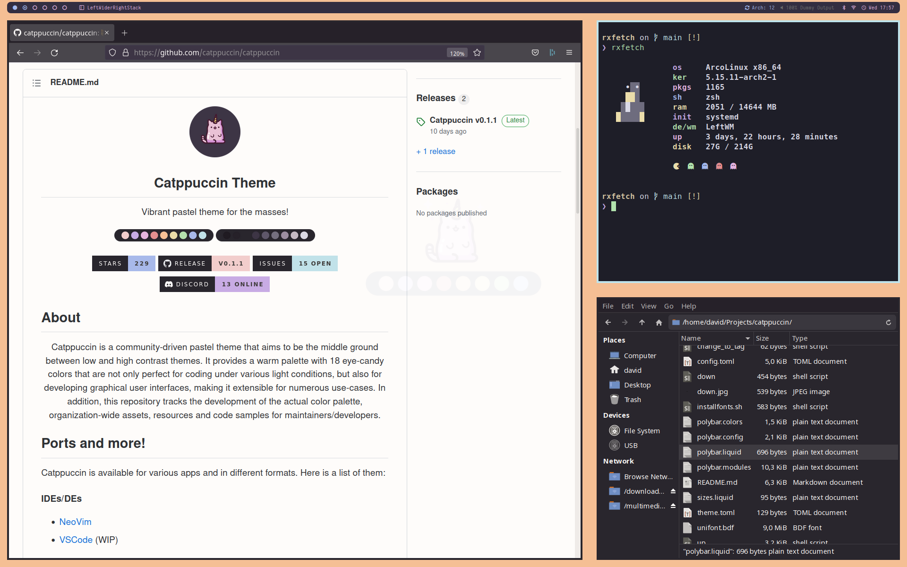
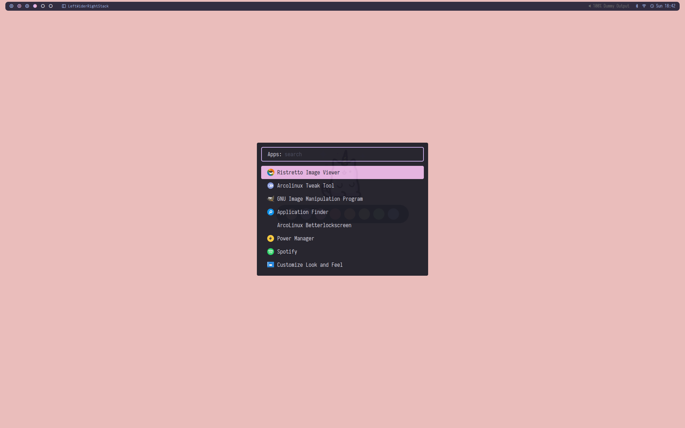
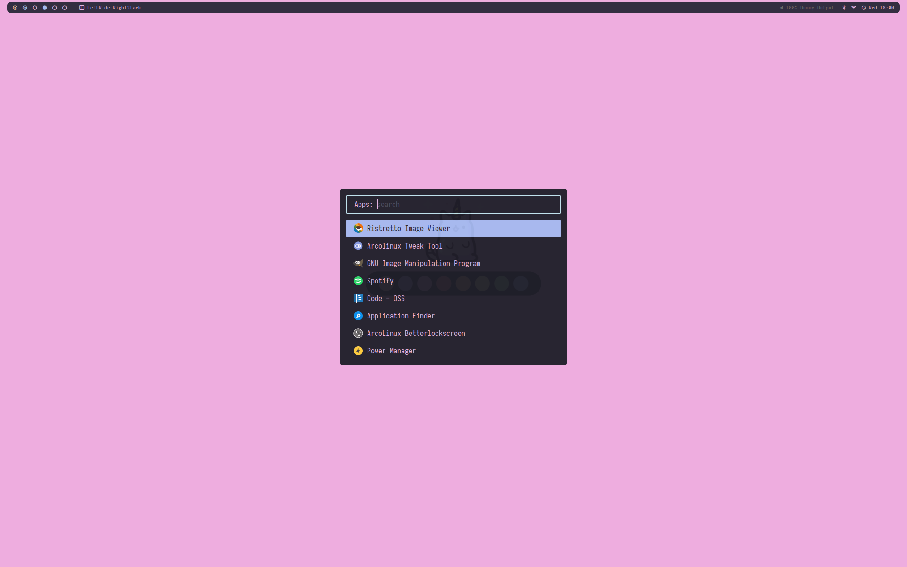
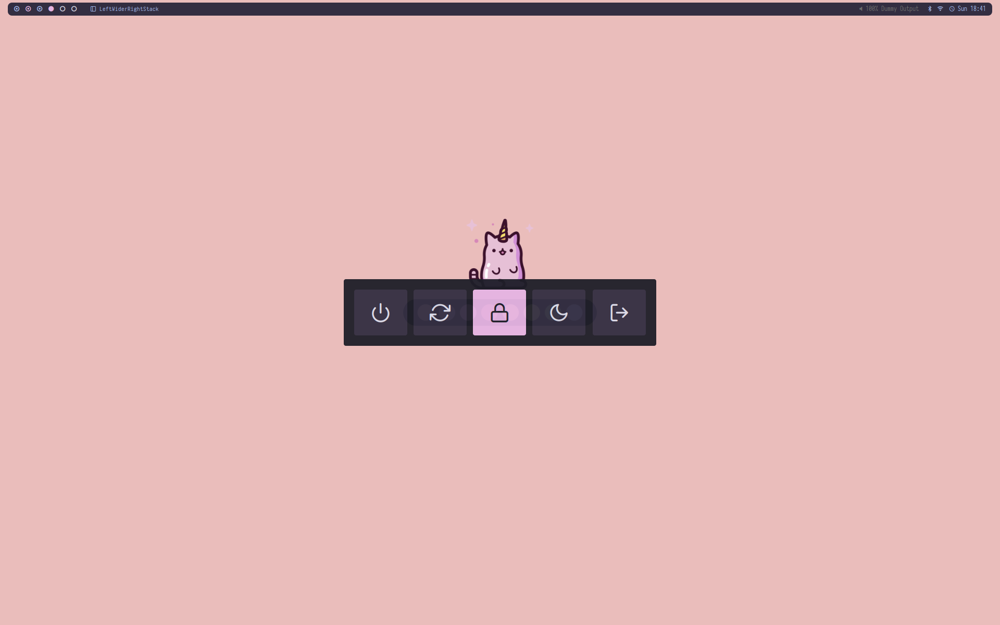
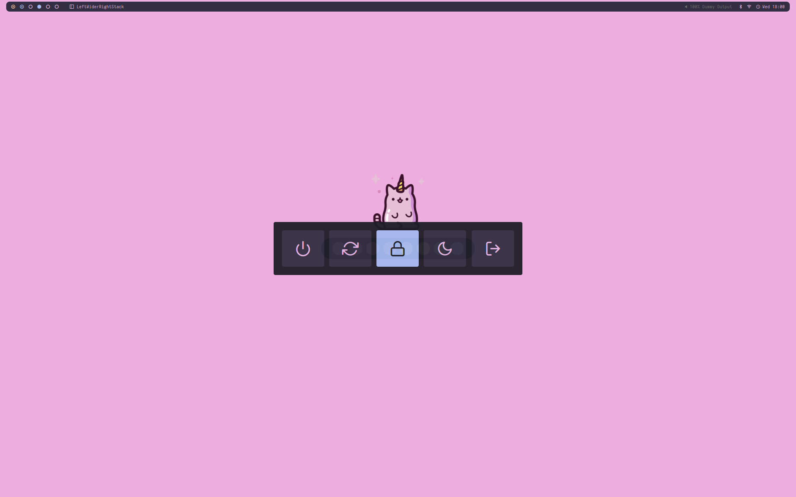
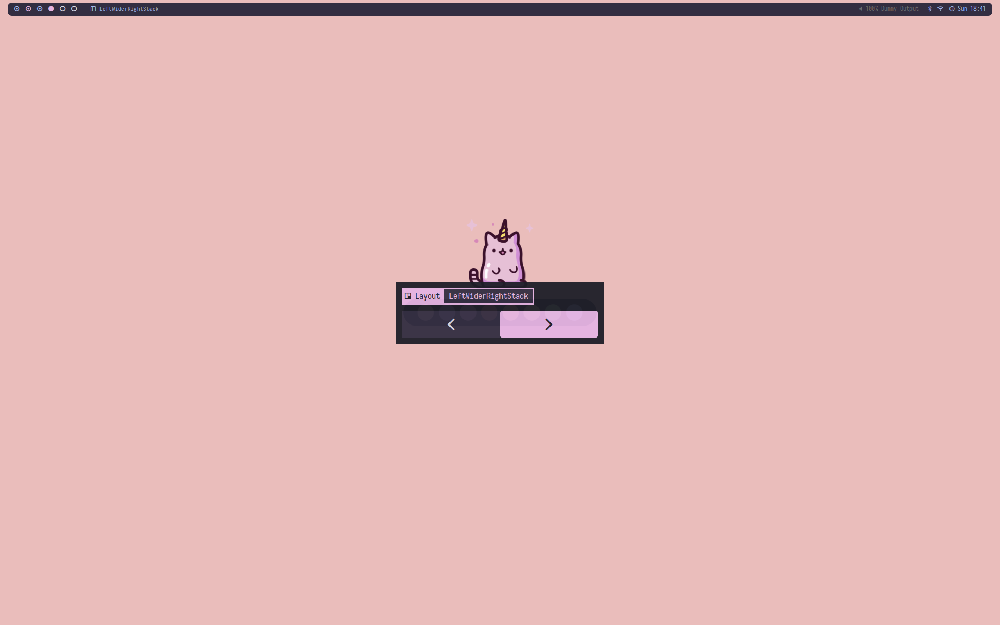
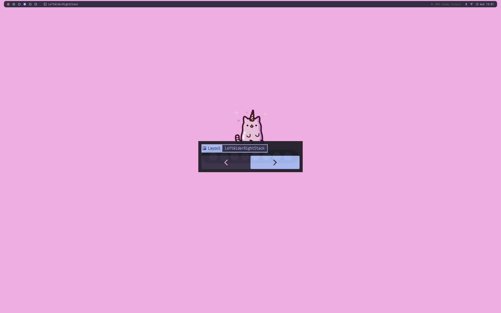

# Catppuccin
*A [LeftWM](https://github.com/leftwm/leftwm) minimalistic theme inspired by the adorable [homonymous pastel theme](https://github.com/catppuccin)*
s

- [Catppuccin](#catppuccin)
- [Screenshots](#screenshots)
- [Dependencies](#dependencies)
- [Installation](#installation)
- [Configuration](#configuration)
  - [Colors](#colors)
  - [Applets](#applets)
  - [Wallpapers](#wallpapers)
  - [Polybar](#polybar)
    - [Pulseaudio Control](#pulseaudio-control)
    - [Systray](#systray)
- [Changelog](#changelog)
  - [v0.1.2](#v012)
  - [v0.1.1](#v011)
  - [v0.1.0](#v010)
  - [To do](#to-do)
- [Credit / Sources](#credit--sources)


# Screenshots









# Dependencies

- [LeftWM](https://github.com/leftwm/leftwm) - duh

`Fonts`
- Iosevka Nerd Font
- Roboto
- Noto Sans
- FontAwesome

Fee free to install some fonts from the theme root folder
```
./installfonts.sh
```

In general it might be a good idea to install all [nerd fonts](https://www.nerdfonts.com/).

`Run by up script`

- polybar
- feh
- numlockx
- picom     

`Run by polybar (and keybindings)`

- pavucontrol
- nm-connection-editor
- blueberry
- pamac


`Misc`
- alacritty (or change configs to match your terminal emulator)
- dunst / xfce4-notifyd  (adapt *up* script accordingly)
- [papirus-icon-theme](https://github.com/PapirusDevelopmentTeam/papirus-icon-theme)


# Installation
1. Install all required dependencies

2. Clone the repository in ~/.config/leftwm/themes

```BASH
cd ~/.config/leftwm/themes
git clone https://github.com/di-effe/catppuccin.git
```

3. Remove the symlink to your current theme if set

```BASH
rm ~/.config/leftwm/themes/current
```
4. Set this as your current theme

```BASH
ln -s ~/.config/leftwm/themes/catppuccin ~/.config/leftwm/themes/current
```

5. Restart your window manager

```Default shortcut
$MOD + Shift + r
```


# Configuration 

## Colors
In a theme like this colors are spread all over the place and it's not fun keep track of everything, every time you want to change something. That's why I am using a custom color script to do the dirty job for me.

Colors are set each time the *UP* script run

```
source $SCRIPTPATH/scripts/colors.sh catppuccin
```

Two color themes are already available to choose from:
- catppuccin
- catppuccin2

Long story short `colors.sh` performs different tasks, mostly `sed`, in all files where colors are set.
The parameter after the script is communicating `colors.sh` to read from the colors variables from `scripts/colors_<THEME_NAME>.sh`, and by default that would be `scripts/colors_catppuccin.sh`

```
## Catppuccin theme
COLOR_BAR_BACKGROUND="#332E41"
COLOR_BAR_FOREGROUND="#B7E5E6"
COLOR_BACKGROUND="#332E41"
COLOR_FOREGROUND="#DFDEF1"
COLOR_FOREGROUND_DARK="#988BA2"
COLOR_PRIMARY="#C6AAE8"
COLOR_SECONDARY="#DFDEF1"
COLOR_ALTERNATE="#C6AAE8"
COLOR_INACTIVE="#6E6C7E"
COLOR_BORDER_ACTIVE="#C6AAE8"
COLOR_BORDER_INACTIVE="#1E1E28"
COLOR_BORDER_FLOATING="#F2CDCD"
COLOR_APPLET_BACKGROUND="#332E41"
COLOR_APPLET_BACKGROUND_LIGHT="#575268"

```

So, if you want to change colors manually comment the source `$SCRIPTPATH/scripts/colors.sh catppuccin` or your changes will be overwritten.

My suggestion, to avoid going crazy, would be to use the same method and 
- create a custom color theme
- add your theme to the `themes=(catppuccin catppuccin2);` array in `colors.sh`
- optionally adapt `colors.sh` to your needs


## Applets

This theme doesn´t have a launcher and powermenu modules configured in Polybar, but you can configured a few keybindings to launch some Rofi applets.

For example you could add these to your `config.toml`

```
# Theme applets

# Launcher
[[keybind]]
command = "Execute"
value = "$HOME/.config/leftwm/themes/current/scripts/launcher.sh"
modifier = ["modkey"]
key = "space"

# Powermenu
[[keybind]]
command = "Execute"
value = "$HOME/.config/leftwm/themes/current/scripts/powermenu.sh"
modifier = ["modkey", "Shift"]
key = "p"

# Layout switcher
[[keybind]]
command = "Execute"
value = "$HOME/.config/leftwm/themes/current/scripts/layout.sh"
modifier = ["modkey", "Shift"]
key = "l"
```

Run a `leftwm-check` to ensure you don´t have multiple bindings on the same keys.


## Wallpapers

*up* is configured with the options to
- set random wallpapers from the /wallpapers folder
- set ONE wallpaper for all displays
- set MULTIPLE wallpapers for all displays (default)

Uncomment what you prefer and comment the rest. It should be clear enough reading the file.


## Polybar

### Pulseaudio Control
This is an interesting module you might want to use, just keep in mind it will grab your device description from

```
pactl list sinks | grep device.description
```

and that is usually a very long string.
The pulseaudio-control module in *polybar.modules* has been configured to use fancier nicknames for speakers and headphone, but you have to replace my values with yours.

For speakers (without any wired or bluetooth headphone connected) check
```
pactl list sinks short | cut -f2
```

and use the output here
```
--sink-nickname "VALUE_DETECTED_HERE:蓼 Speakers" 
```

For wired headphones, plug them, check again
```
pactl list sinks short | cut -f2
```

and use the output here
```
--sink-nickname "VALUE_DETECTED_HER: Headphones"
```


### Systray
Systray has beed disabled by default in *polybar.config*
```
tray-position = none
```
If you want to use it change position and adjust the **tray-offset-x** value.


# Changelog

## v0.1.2
- catppuccino 1.2 updates

## v0.1.1
- Multiple color themes
  - catppuccin
  - catppuccin2
- Updated documentation
- Minor changes


## v0.1.0
- First release


## To do
- [x] More color schemes from the catppuccin project


# Credit / Sources

- Polybar modules configuration style (plus snippets and scripts) from [Peter Dauwe](https://github.com/PeterDauwe) and [adi1090x](https://github.com/adi1090x/polybar-themes)

- Application launcher is based on the [rofi-themes-collection](https://github.com/lr-tech/rofi-themes-collection) by [LR Tech](https://github.com/lr-tech) covered by a GNU General Public License v3.0

- Powermenu is loosely based on the [rofi-themes](hhttps://github.com/adi1090x/rofi) by [adi1090x](https://github.com/adi1090x) covered by a GNU General Public License v3.0

- Wallpapers and color schemes by [catppuccin](https://github.com/catppuccin/), of course